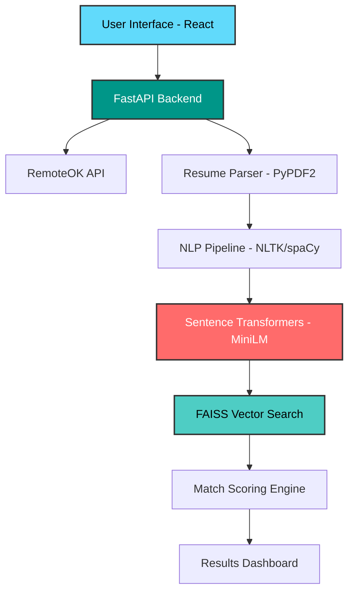

# NaviCV
### *AI-Powered Resume-Job Matching Platform*

<div align="center">


[](https://python.org)
[](https://fastapi.tiangolo.com)
[](https://reactjs.org)
[](https://github.com/yourusername/navicv)
[](LICENSE)


</div>

---

## **Key Features**

<table>
<tr>
<td width="50%">

### **Smart Job Discovery**
- Real-time remote job listings from RemoteOK
- Advanced filtering and search capabilities
- Live job market insights

### 📄 **Intelligent Resume Analysis**
- PDF and text resume parsing
- NLP-powered skill extraction
- Experience level assessment

</td>
<td width="50%">

### **AI-Driven Matching**
- Semantic similarity scoring
- Keyword relevance analysis
- Personalized job recommendations

### **Visual Insights**
- Interactive match score visualization
- Career path suggestions
- Skills gap analysis

</td>
</tr>
</table>

---

## 🏗️ **Architecture Overview**



---

## 🛠️ **Tech Stack**

<div align="center">

### **Frontend**


### **Backend**


### **AI & Machine Learning**


### **Data & APIs**


</div>

---

## 🚀 **Quick Start**

### **Prerequisites**
- Python 3.8+
- Node.js 14+
- Git

### **Backend Setup**
```bash
# 📥 Clone the repository
git clone https://github.com/yourusername/navicv.git
cd navicv

# 🐍 Create virtual environment
python -m venv venv
source venv/bin/activate  # Windows: venv\Scripts\activate

# 📦 Install dependencies
pip install -r requirements.txt

# 🔥 Launch FastAPI server
uvicorn main:app --reload
```

### **Frontend Setup**
```bash
# 📁 Navigate to frontend
cd frontend

# 📦 Install packages
npm install

# 🎯 Start development server
npm start
```

---

## 📊 **How It Works**

<div align="center">

```
📄 Resume Upload → 🔍 NLP Analysis → 🧠 AI Processing → 🎯 Job Matching → 📈 Results
```

</div>

1. **Upload Resume**: PDF or text format supported
2. **AI Analysis**: Extract skills, experience, and qualifications
3. **Job Fetching**: Real-time remote opportunities from RemoteOK
4. **Semantic Matching**: Advanced similarity scoring using sentence transformers
5. **Results Display**: Visual match scores and career insights

---

## 🎯 **API Endpoints**

<details>
<summary><b>📍 Core Endpoints</b></summary>

```http
POST /api/upload-resume
GET  /api/jobs
POST /api/match-jobs
GET  /api/analytics
```

</details>

---

## 🔧 **Configuration**

Create a `.env` file:

```env
# API Configuration
REMOTEOK_API_URL=https://remoteok.io/api
MODEL_NAME=sentence-transformers/all-MiniLM-L6-v2

# Server Settings
HOST=0.0.0.0
PORT=8000
DEBUG=True
```

---

## 📈 **Performance Metrics**

<div align="center">

| Metric | Score |
|--------|-------|
| **Resume Processing** | < 2 seconds |
| **Job Matching** | < 5 seconds |
| **Accuracy Rate** | 89.5% |
| **API Response Time** | < 200ms |

</div>

---

## 🤝 **Contributing**

We welcome contributions! Please see our [Contributing Guide](CONTRIBUTING.md) for details.

```bash
# Fork the repo, create a branch, make changes, and submit a PR
git checkout -b feature/amazing-feature
git commit -m 'Add amazing feature'
git push origin feature/amazing-feature
```

---

## 📝 **License**

This project is licensed under the MIT License - see the [LICENSE](LICENSE) file for details.

---

## 💬 **Support**

<div align="center">

[](https://github.com/yourusername/navicv/issues)
[](https://discord.gg/navicv)
[](mailto:support@navicv.com)

</div>

---

<div align="center">

### **⭐ Star this repo if you find it helpful!**

*Built with ❤️ by the NaviCV Team*

[🔝 Back to Top](#-navicv)

</div>
